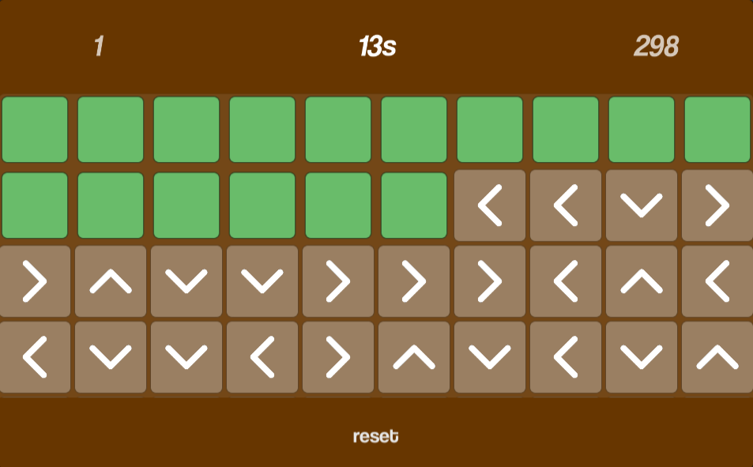
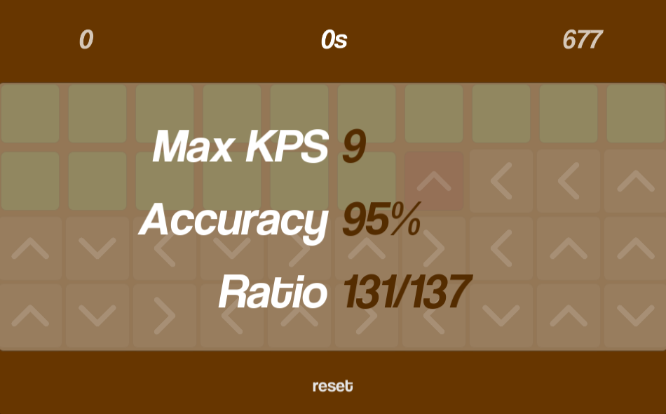

# [](https://dev-evening.itch.io/monkeydance)

## [**Play Here on itch.io**](https://dev-evening.itch.io/monkeydance)

Created in a 24h for a school mini-project.

Play simply using arrow keys.

Inspired by **monkeytype**

## Screenshots





## Known Bugs

- Some arrows don't visually if the player presses too fast.

# Documentation

## Introduction

This is a simple one-scene single-player local game. 

Heavily inspired by [monkeytype](https://monkeytype.com/), using arrows instead of letters.

Done in Unity, exported to WebGL and uploaded to [itch.io](https://itch.io/).

## Methodology

The overview is simple, track inputs from `Input.__Arrow`, check them and run the appropriate functions.

There are a few notable features

- Animations
- Coroutines
- Prefab Generation & Layout
- Code Formatting

### Animations

The animations are simply animation clips triggered via script.

Take a look at the script that makes the current arrow state successful

```cs
private IEnumerator SetArrowGood()
{
    CurrentArrow().GetComponent<Animator>().SetTrigger("Good");
    // ...
    yield break;
}
```

By setting the **bool trigger** of the `Animator`, we automatically run the animation of the arrow.

One could run a separate coroutine that **LERPs** the animation but I don't require that much control.

Most of the other animations are done similarly.

### Coroutines

The game runs heavily on Coroutines as some animations run asynchronously and I want a smooth gameplay.

A simple example used is the Key Per Second (KPS) Tracker

```cs
private IEnumerator AddKpsThread()
{
    Kps += 1;
    StartCoroutine(AddScore());
    yield return new WaitForSeconds(1);
    Kps -= 1;
}
```

Notice how the accumulation of `Coroutine` threads can simulate a KPS system.

A bug is due to this though, I'll leave it as it's not vital.

### Prefab Generation & Layout

The prefab arrows are generated are layed out in a wrap-around grid.

e.g.

```
Hierarchy
- Play Area (Grid Layout)
  - Arrow 1
  - Arrow 2
  - ...
  - Arrow 16

Wraps as 2x8
OOOOOOOO
OOOOOOOO

Wraps as 4x4
OOOO
OOOO
OOOO
OOOO
```

This saves a lot of finnicky layout issues

### Code Layout

I like coding, especially making it clean.

There are a few tricks you may observe from the code

- `partial` file splitting
- **Properties** `get` `set`. See `GameManager.Score.Score`
  - By setting the Score property, you also set the Score Text. This is an excellent code pattern.
- Automatic Old Arrow trimming. See `GameManager.CheckArrowRow`
- Manual Animation LERPing. See: `GameManager.DeleteFirstArrowRowAnim`
- Enum Classes. See: `Arrow.EDirection` / `GameManager.Timer.GameState`.

